# Очередь и стек

## Задача: реализовать очередь и стек на массивах и на списках и сравнить скорость работы.

Необходимо реализовать функции добавления и извлечения элемента. Представим абстракции стека и очереди как структур данных:

### Стек

**Стек (stack)** - структура в которой элементы добавляются в конец и извелекаются также с конца.

### Очередь

**Очередь (queue)** - структура в которой элементы добавляются в конец, а извлекаются с начала.

## Решение

Вашему вниманию предлагается графическое представление задачи:

| абстракция | детали обстракции |
| ----- | ----- |
| 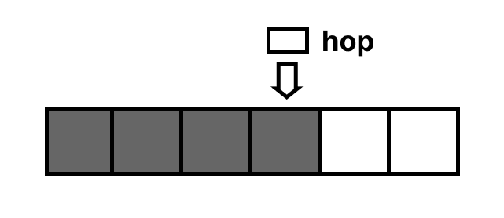 | hop - указатель на последний добавленный элемент |
|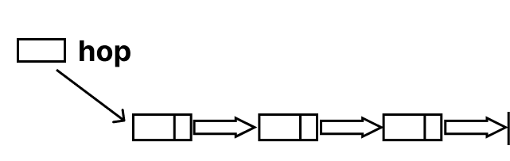| hop - указатель на последний добавленный элемент |
| | first - указатель на первый вошедший в очередь элемент, last - указатель на последний вошедший элемент |
| | first - указатель на первый вошедший в очередь элемент, last - указатель на последний вошедший элемент |

## Пограничные случаи

Рассмотрим пограничные случаи для каждого из представленных выше абстракций

| абстракция | картинка | пограничные случаи на добавление и удаление элементов |
|-------------|--------|---------------------|
|Стек на массивах |  | <ol> <li>В стеке нет элементов. **Проблема добавления:** указатель hop указывает в пустоту. **Проблема извлечения:** нечего извлекать из пустоты. </li> <li> Массив заполнен полностью. **Проблема добавления:** нет места для добавления. |
| Стек на списках |  | --- |
| Очередь на массивах |  | <ol> <li> В очереди нет элементов. **Проблема добавления:** указатель first указывает в пустоту. **Проблема извлечения:** нечего извлекать из пустоты. |
| Очередь на списках |  | --- |

## Реализация на языке С++

Реализовано с помощью структур

| структура данных | поля структуры | функция добавления | функция извлечения |
|------|-----|------|----|
| стек на массивах | 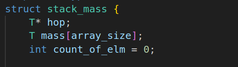 | 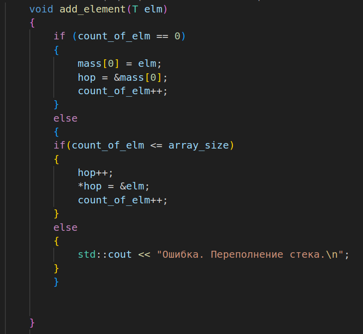 | 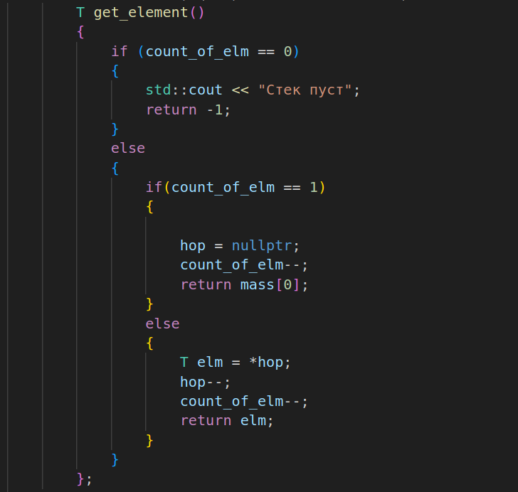 |
| стек на списках  | 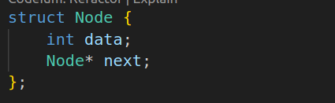 | 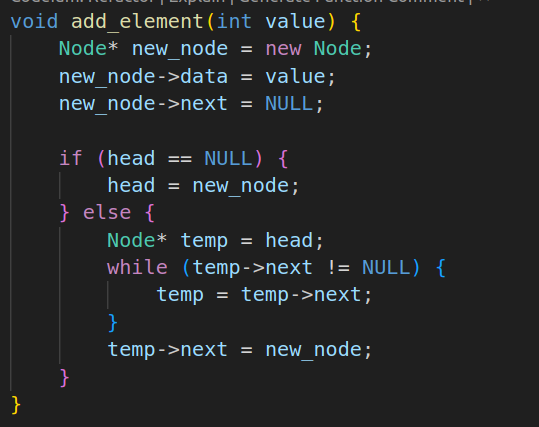 |  |
| очередь на списках|  | 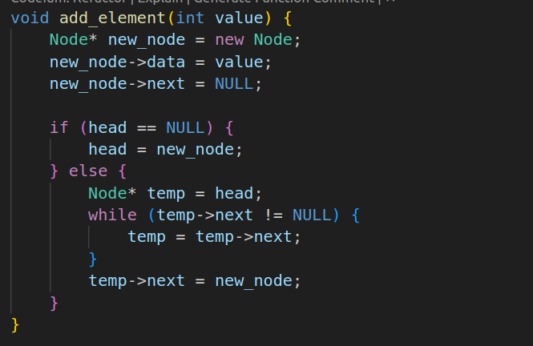 | 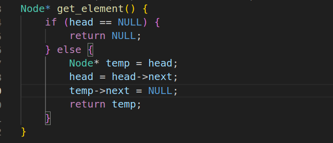 |
| очередь на массивах |  | 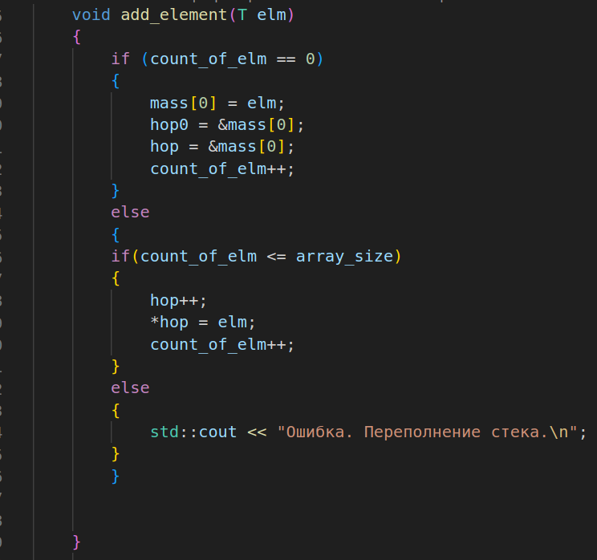 |  |

# Заключение

## Ниже представлена таблица сравнения скорости с измерениями результатов:

| структура | добавление 100 элементов | извлечение 100 элементов | добавление 1000 элементов | извлечение 1000 элементов
|----|----|----|------|----|
|стек на массивах| 0.000000939 сек | 0.000000493 сек| 0.000008399 сек| 0.000006896 сек|
|стек на списках| 0.00003031 сек| 0.00002077 сек| 0.000193433 сек | 0.00017239 сек|
|очередь на массивах | 0.000001174 сек| 0.000000712 сек| 0.000007189 сек| 0.00000661 сек|
|очередь на списках |0.00002422 сек| 0.000004001 сек|0.0002024 сек| 0.000028085 сек|

## Возьмем промежуточные значения 500, 5000 и 10000 элементов. А теперь это же сравнение представим в виде графиков:

<!-- 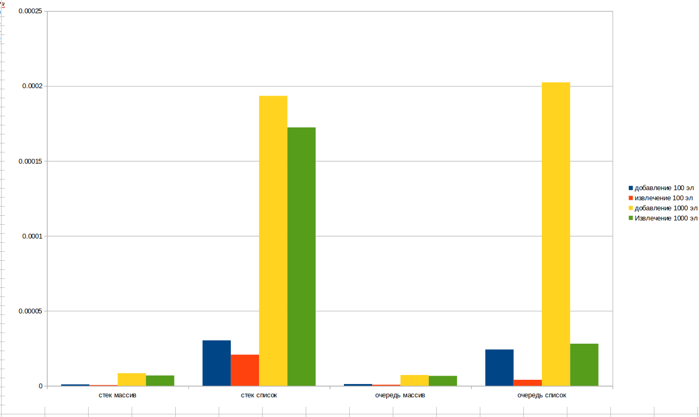 -->

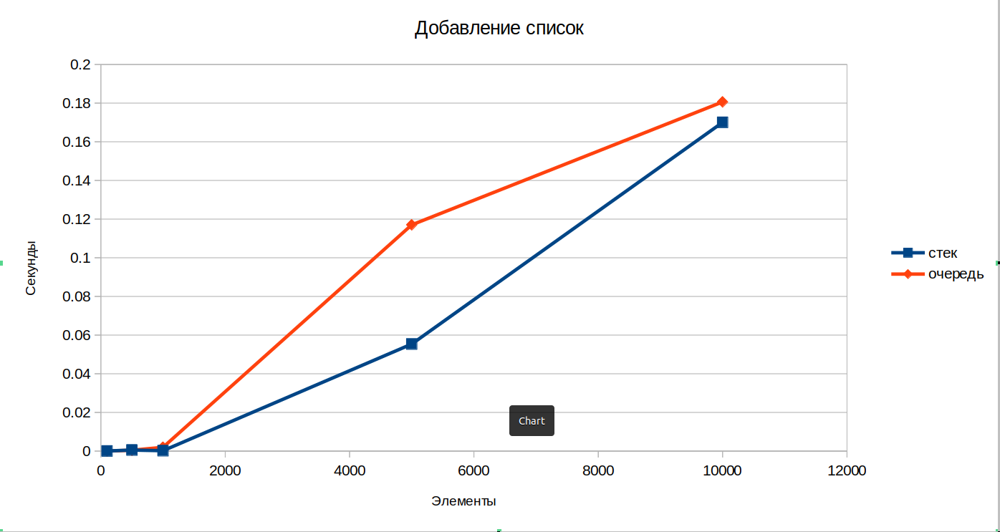

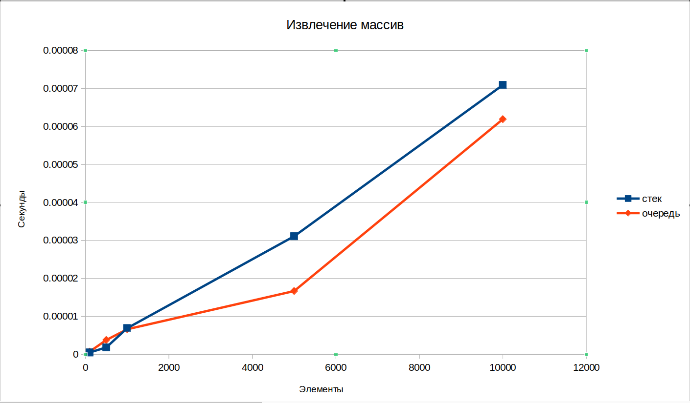

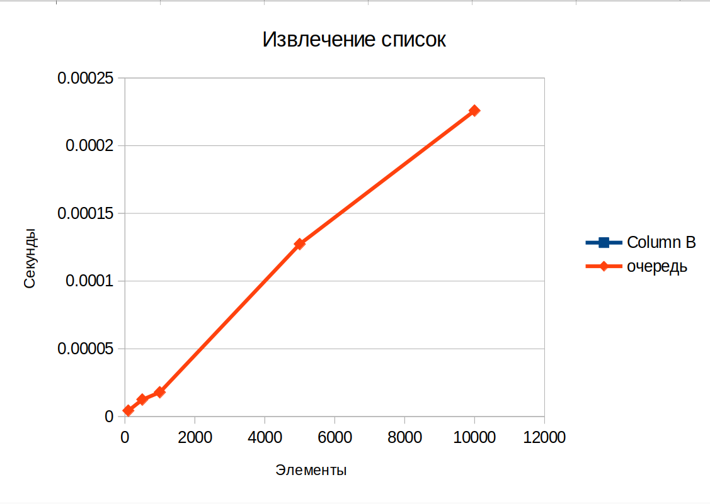

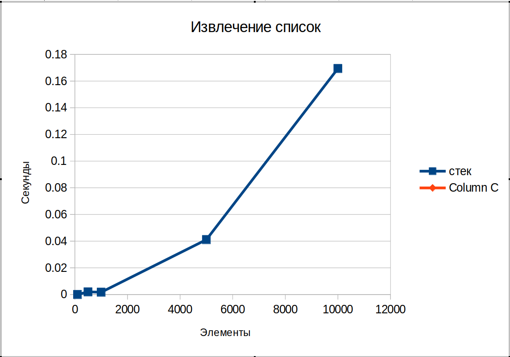

Видим здесь линейную зависимость времени от количества элементов: чем больше элементов, тем больше время.

# Вывод

Данные структуры очень сильно различаются. Стек на массиве имеет ограниченный размер, он может переполниться. Зато он обеспечивает быстрый доступ к элементам в отличии от стека на списках. Очередь на массиве обеспечивает быстрое добавление элементов. Исходя из графика видно что структуры на массивах быстрее, так как адреса элементов расположены последовательно и не надо обращаться так часто к памяти как на списках. Списки лучше использовать когда нужно динамическое использование памяти и нужно ее экономить. Если же важнее скорость, то лучше использовать массивы. Также можно сказать что извлекаются элементы быстрее из очеререди, так как за это отвечает другой указатель, который указывает на начало очереди.

 

